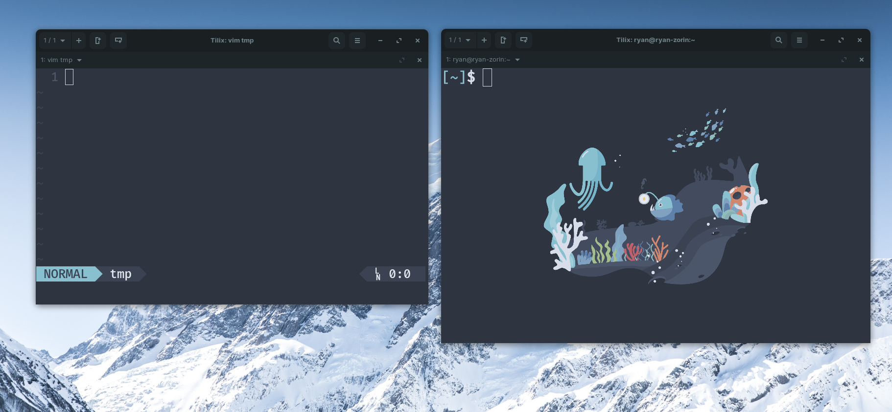

# Linux Config
  * OS - Ubuntu Budgie

# Shell Config
  * Terminal Emulator - [Tilix](https://github.com/gnunn1/tilix)
  * Tilix Background - [Image](tilixbck.png)
  * Font - [FuraCode Nerd Font Mono Medium](https://github.com/ryanoasis/nerd-fonts/tree/master/patched-fonts/FiraMono/Medium/complete)
  * Shell - [Oh My Zsh](https://ohmyz.sh/)
  * Color Scheme - [Nord](https://www.nordtheme.com/)

# Vim Config
  * [Vundle](https://github.com/VundleVim/Vundle.vim)
  * [Lightline](https://github.com/itchyny/lightline.vim)
  * [Lightline-Bufferline](https://github.com/mengelbrecht/lightline-bufferline)
  * [Lightline-Ale](https://github.com/maximbaz/lightline-ale)
  * [Gitbranch](https://github.com/itchyny/vim-gitbranch)
  * [VimCompletesMe](https://github.com/ackyshake/VimCompletesMe)
  * [NerdCommenter](https://github.com/preservim/nerdcommenter)
  * [delimitmate](https://github.com/raimondi/delimitmate)
  * [vim-template](https://github.com/aperezdc/vim-template)
  * [vim-move](https://github.com/matze/vim-move)
  * [nord-vim](https://github.com/arcticicestudio/nord-vim)
  * [python-syntax](https://github.com/vim-python/python-syntax)
  * [Ale](https://github.com/dense-analysis/ale)
  * [Vim-Runner](https://github.com/aben20807/vim-runner)

